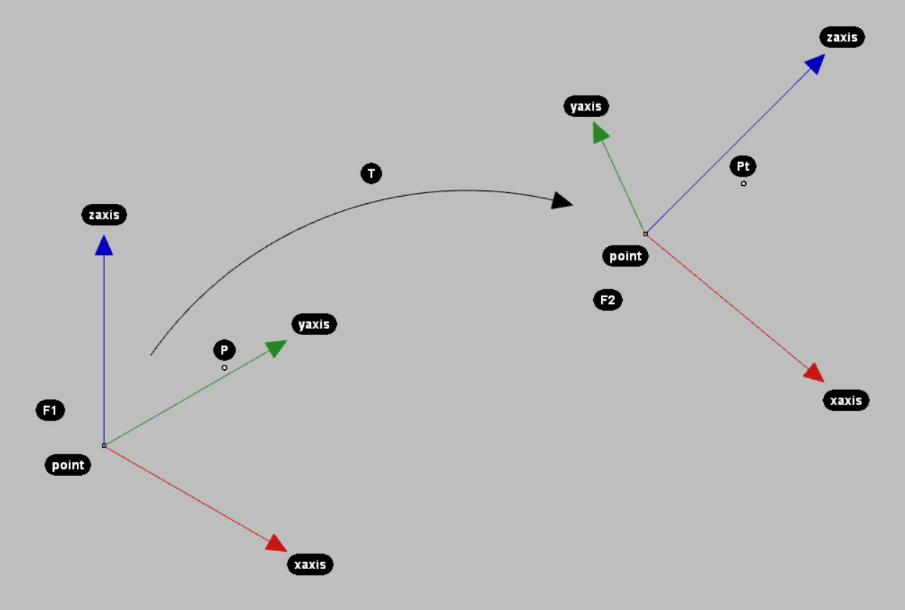

.. _examples_frame_and_transformation:

********************************************************************************
Frame and Transformation
********************************************************************************

.. contents::

``Frame`` and ``Transformation`` are two basic classes in the compas library and
can be used to describe position/orientation and coordinate systems. The 
``Frame`` consists of a point and and two orthonormal base vectors (xaxis, 
yaxis). ``Transformation`` is the base class for transformations like 
``Rotation``, ``Translation``, ``Scale``, ``Reflection``, ``Projection`` and 
``Shear``.

Here is a simple example of how to use Frame and Transformation: We want to 
bring a point P in the coordinate system of frame F1 into the coordinate system
of frame F2.

	from compas.geometry import Frame
	from compas.geometry import Transformation

	point =  [0.0, 0.0, 63.0]
	xaxis =  [1.0, 0.0, 0.0]
	yaxis =  [0.0, 1.0, 0.0]

	F1 = Frame(point, xaxis, yaxis)

	point =  [146.00, 150.00, 161.50]
	xaxis =  [0.9767, 0.0010, -0.214]
	yaxis =  [0.1002, 0.8818, 0.4609]

	F2 = Frame(point, xaxis, yaxis)

	P = [35., 35., 35.] # point in frame F1

	# bring P into worldXY frame.
	Tw = Transformation.from_frame_to_frame(Frame.worldXY(), F1)
	Pw = T0.transform_point(P)

	# bring Pw into frame F2
	T = Transformation.from_frame_to_frame(F1, F2)
	Pt = T.transform_point(Pw)

From the frame, or resp. from the orientation (``Rotation``) that is defined 
through the frame, we can derive several other representations of rotation, such
as axis-angle representations, Euler angles, quaternion and basis vectors.

    from compas.geometry import Frame
    F1 = Frame([0, 0, 0], [0.68, 0.68, 0.27], [-0.67, 0.73, -0.15])
    R = Rotation.from_frame(F1)
    args = False, 'xyz'
    alpha, beta, gamma = R.euler_angles(*args)
    xaxis, yaxis, zaxis = [1, 0, 0], [0, 1, 0], [0, 0, 1]
    Rx = Rotation.from_axis_and_angle(xaxis, alpha)
    Ry = Rotation.from_axis_and_angle(yaxis, beta)
    Rz = Rotation.from_axis_and_angle(zaxis, gamma)
    F2 = Frame.worldXY()
    F1 == F2.transform(Rx * Ry * Rz)
