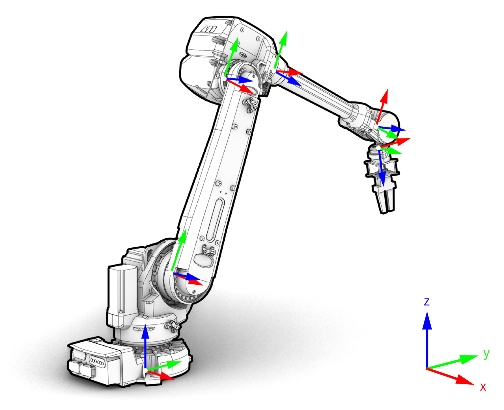

********************************************************************************
Kinematic model
********************************************************************************

.. contents::

.. _RobotModel: http://docs.ros.org/kinetic/api/moveit_core/html/classmoveit_1_1core_1_1RobotModel.html

In the kinematic model of a robot, the connection of different manipulator joints is known as link, and the integration of two or more links is called a joint. This kinematic model can be represented as a tree structure. The tree describes the kinematic chain, i.e., the connection of robotic links with joints, and the inter-dependendencies of these links. In ROS, this tree structure plus the underlying geometric information is defined in XML format in a URDF file, and is stored in the class RobotModel_.

.. image:: link.png
   :scale: 50
Tree structure of a robot describing the kinematic model.

Links
==================
Robot links are thee solid mechanical elements. Depending on the kinematic model, movement of certain input links allows the output links to move at various motions.

Joints
==================
The joints are the elements in a robot which helps the links to travel in different kind of movements. The two major types of joints are:

* Rotational joint
* Linear joint

Furthermode, joints can be defined as fixed, active (controllable), or passive (uncontrollable).

More info:
http://wiki.ros.org/urdf/Tutorials/Create%20your%20own%20urdf%20file
https://www.codemade.io/create-your-own-urdf-file/
