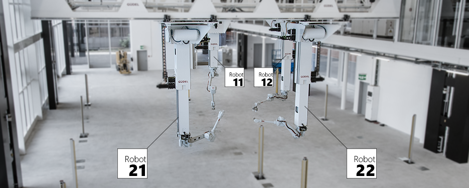

.. _examples_rfl:

********************************************************************************
RFL Simulation examples
********************************************************************************

.. contents::

RFL simulation requires a running instance of `v-rep <http://www.coppeliarobotics.com/>`_
with the RFL scene pre-loaded. There are two options to run v-rep:

 * `Download it <http://www.coppeliarobotics.com/downloads.html>`_, install it
   and open the RFL scene file contained in this package
   (``fabrication\robots\rfl\vrep_remote_api\rfl_scene.ttt``).
 * Install as a service using Docker (only on Windows 10 and higher):

   * Make sure you have `Docker <https://www.docker.com/>`_ installed.
   * Run the following commands on the command line::

        docker pull gramaziokohler/vrep-rfl:3.3
        docker run -p 19997:19997 -d gramaziokohler/vrep-rfl:3.3

Basic example
=============

The most basic example is just connect to the simulator and verify the connection
is working.

Copy and paste the following example and run it, you should see ``Connected: True``
if everything is working properly::

    from compas_fabrication.fabrication.robots.rfl import *

    with Simulator() as simulator:
        print ('Connected: %s' % simulator.is_connected())

Moving robots
=============

The RFL has 4 robots that can be referenced by an identifier: ``11``, ``12``, ``21`` and ``22``.

It's important to make sure all four of them are positioned correctly and not colliding with each other at start, otherwise path planning will fail.

The position of a robot is specified as an instance of :class:`compas_fabrication.fabrication.robots.rfl.Configuration`.

Here's a simple example on how to position two of the robots::

    from compas_fabrication.fabrication.robots.rfl import *

    config_robot_a    = Configuration(coordinates=[8.26, -1, -3.69],
                                    joint_values=[190, 0, 0, 0, 90, 0])
    config_robot_b    = Configuration(coordinates=[8.26, -8.32, -3.69],
                                    joint_values=[190, 0, 0, 0, 90, 0])

    with Simulator() as simulator:
        robot_a = Robot(11, client=simulator)
        robot_b = Robot(12, client=simulator)

        simulator.set_robot_config(robot_a, config_robot_a)
        simulator.set_robot_config(robot_b, config_robot_b)

Basic path planning example
===========================

Calculating a path plan requires several parameters to be configured in order to start
the process. In its minimal expression, a path planning request must define a start
configuration and a goal pose and rely on defaults for the rest. Here is an example
of such a request::

    from compas_fabrication.fabrication.robots.rfl import *

    start_config    = Configuration(coordinates=[8.26, -5.32, -3.69],
                                    joint_values=[-143, 37, -112, 0, -15, -126])
    goal_pose       = [-1.0, 0.0, 0.0, 8.11,
                       0.0, 0.0, -1.0, -7.02,
                       0.0, -1.0, 0.0, -1.81]

    with Simulator() as simulator:
        robot = Robot(12, client=simulator)

        simulator.set_robot_config(robot, start_config)
        path = simulator.find_path_plan(robot, goal_pose)
        print('Found path of %d steps' % len(path))

Complete path planning example
==============================

The following example showcases a lot of the configuration options available when
calculating a path plan::

    import logging
    from compas.datastructures.mesh import Mesh
    from compas_fabrication import get_data
    from compas_fabrication.fabrication.robots.rfl import *

    # Configure logging to DEBUG to see detailed timing of the path planning
    logging.basicConfig(level=logging.DEBUG)

    # Configure parameters for path planning
    start_pose      = [0.0, 1.0, 0.0, 7.453,
                       -1.0, 0.0, 0.0, -10.919,
                       0.0, 0.0, 1.0, -0.609]
    goal_pose       = [-1.0, 0.0, 0.0, 8.11,
                       8.97e-13, 0.0, -1.0, -6.92,
                       0.0, -1.0, 0.0, -1.81]
    algorithm       = 'rrtconnect'
    max_trials      = 1
    resolution      = 0.02
    building_member = Mesh.from_obj(get_data('timber_beam.obj'))
    structure       = [Mesh.from_obj(get_data('timber_structure.obj'))]
    metric          = [0.1] * 9
    fast_search     = True 

    with Simulator(debug=True) as simulator:
        robot = Robot(12, client=simulator)

        simulator.reset_all_robots()
        simulator.pick_building_member(robot, building_member, start_pose)
        path = simulator.find_path_plan(robot,
                                        goal_pose,
                                        collision_meshes=structure,
                                        algorithm=algorithm,
                                        trials=max_trials,
                                        resolution=resolution)

        print('Found path of %d steps' % len(path))
