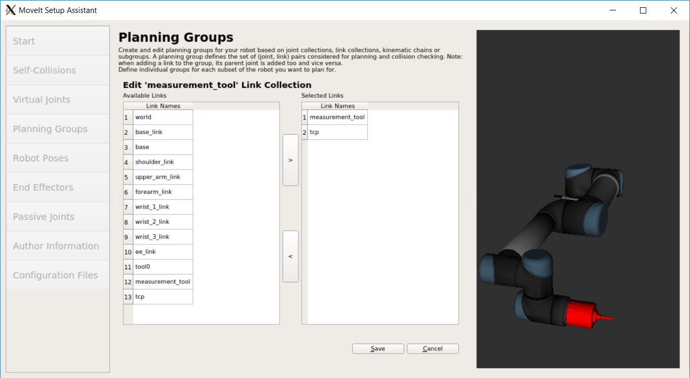
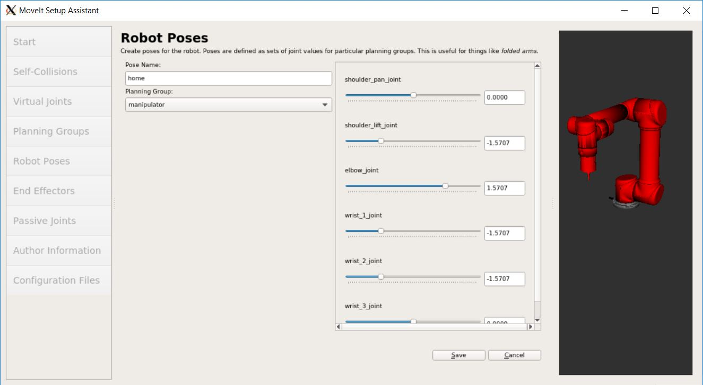

.. _ros_examples_create_moveit_package_from_custom_urdf:

********************************************************************************
Advanced: Using custom URDF in MoveIt!
********************************************************************************

This example is mainly copied from `MoveIt! Setup Assistant Tutorial <https://docs.ros.org/kinetic/api/moveit_tutorials/html/doc/setup_assistant/setup_assistant_tutorial.html>`_

It is based on the previous example:
:ref:`Creating a URDF with an UR5 robot and a custom end-effector <ros_examples_create_urdf_ur5_with_measurement_tool>`

Start the MoveIt! Setup Assistant
=================================

The MoveIt! Setup Assistant is a graphical user interface for configuring any
robot for use with MoveIt!. Its primary functions are to generate a Semantic Robot
Description Format (SRDF) file, to create the collision matrix of your robot
and to define the planning groups.

* To start the MoveIt! Setup Assistant, launch the following from your Linux command prompt::

    roslaunch moveit_setup_assistant setup_assistant.launch

* Press *Create New MoveIt Configuration Package*
* Click on the browse button and navigate to the ``ur5_with_measurement_tool.urdf``
  file you created in the last example. Choose that file and then click
  *Load Files.* The Setup Assistant will load the files (this might take a few
  seconds) and present you with this screen:

.. figure:: images/08_ros_create_moveit_package_00.jpg
    :figclass: figure
    :class: figure-img img-fluid

Generate Self-Collision Matrix
==============================

* Click on the *Self-Collisions* pane selector on the left-hand side.
* Click on the *Generate Collision Matrix* button. The Setup Assistant will work for a few
  seconds before presenting you the results of its computation in the main table.

Note:
    The sampling density specifies how many random robot positions to check for self
    collision. The default value of 10'000 collision checks should be fine.

.. figure:: images/08_ros_create_moveit_package_01.jpg
    :figclass: figure
    :class: figure-img img-fluid

Add Virtual Joints
==================

Virtual joints are used primarily to attach the robot to the world coordinate
frame. We will define only one virtual joint, attaching the
``ur5_with_measurement_tool`` to the world coordinate frame.

* Click on the *Virtual Joints* pane selector. Click on *Add Virtual Joint*
* Set the joint name as "virtual_joint"
* Set the child link as "world" and the parent frame name as "world".
* Set the Joint Type as "fixed".
* Click *Save*.

.. figure:: images/08_ros_create_moveit_package_02.jpg
    :figclass: figure
    :class: figure-img img-fluid

Add Planning Groups
===================

Planning groups are used for semantically describing different parts of your
robot, such as defining what an arm is, or an end-effector. The planning group
is later used for path- and motion planning.

* Click on the *Planning Groups* pane selector.
* Click on *Add Group* and you should see the following screen:

.. figure:: images/08_ros_create_moveit_package_03.jpg
    :figclass: figure
    :class: figure-img img-fluid

Add the arm
-----------

* Enter *Group Name* as "manipulator"
* Choose ur_kinematics/UR5KinematicsPlugin as the kinematics solver.
* Let *Kin. Search Resolution*, *Kin. Search Timeout (sec)*, *Kin. Solver Attempts* and
  *Group Default Planner* stay at their default values.

.. figure:: images/08_ros_create_moveit_package_04.jpg
    :figclass: figure
    :class: figure-img img-fluid

* Click on the *Add Kin. Chain* button. Press *Expand All*

.. figure:: images/08_ros_create_moveit_package_05.jpg
    :figclass: figure
    :class: figure-img img-fluid

* Select the "base_link" as *Base Link* and the "tcp" as *Tip Link*
* Press the *Save* button.

Add the gripper
---------------

We will also add a group for the end-effector.

.. note::

    You will do this using a different procedure than adding the arm.

* Click on the *Add Group* button.
* Enter *Group Name* as "measurement_tool"
* Let *Kinematic Solver*, *Kin. Search Resolution*, *Kin. Search Timeout (sec)*, *Kin. Solver Attempts* and
  *Group Default Planner* stay at their default values.
* Click on the *Add Links* button.
* Choose measurment_tool and tcp (The links you defined in the measurement_tool.xacro) and add them to the list of *Selected Links* on     the right hand side.
* Click *Save*

Add Robot Poses
===============

The *Setup Assistant* allows you to add certain fixed poses into the
configuration. This helps if, for example, you want to define a certain position
of the robot as a *Home* position.

* Click on the *Robot Poses* pane.
* Click *Add Pose*. Choose a name for the pose. The robot will be in its
  *Default* position where the joint values are set to the mid-range of the
  allowed joint value range. Move the individual joints around until you are happy
  and then *Save* the pose.

Tip:
    Try to move all the joints around. If there is something wrong
    with the joint limits in your URDF, you should be able to see it immediately here.

Label End-Effectors
===================

We have already added the measurement_tool of the ur5. Now, we will designate
this group as a special group: end effectors.

* Click on the *End Effectors* pane.
* Click *Add End Effector*.
* Choose ``measurement_tool`` as the *End Effector Name* for the measurement tool.
* Select "measurement_tool" as the *End Effector Group*.
* Select "tool0" as the *Parent Link* for this end-effector.
* Leave *Parent Group* empty.
* Press *Save*.

.. figure:: images/08_ros_create_moveit_package_08.jpg
    :figclass: figure
    :class: figure-img img-fluid

Add Passive Joints
==================

Skip this step.

Add Author Information
======================

* Click on the *Author Information* pane.
* Enter your name and email address.

Generate Configuration Files
============================

You are almost there. One last step!

* Click on the Configuration Files pane.
* Click *Browse*, select the ``robotic_setups/src`` location. Click
  *Create New Folder*, call it "ur5_with_measurement_tool_moveit_config", and
  click *Choose*.
* Click on the *Generate Package* button. The Setup Assistant will now generate
  and write a set of launch and config files into the directory of your choosing.
  All the generated files will appear in the Generated Files/Folders tab and you
  can click on each of them for a description of what they contain.

Start the newly generated MoveIt! Configuration
===============================================

Now, optionally, you can already start the MoveIt! Demo and play::

    cd ~/robotic_setups
    catkin_make
    source devel/setup.bash
    roslaunch ur5_with_measurement_tool_moveit_config  demo.launch rviz_tutorial:=true

.. figure:: images/08_ros_create_moveit_package_10.jpg
    :figclass: figure
    :class: figure-img img-fluid

Further links
=============

* https://docs.ros.org/kinetic/api/moveit_tutorials/html/doc/setup_assistant/setup_assistant_tutorial.html
* https://docs.ros.org/kinetic/api/moveit_tutorials/html/doc/urdf_srdf/urdf_srdf_tutorial.html
