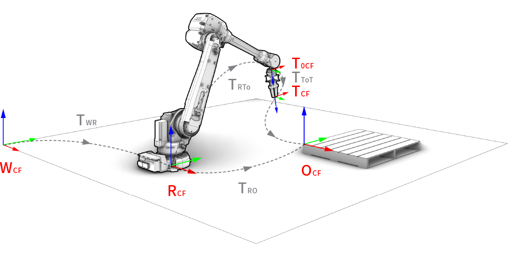

.. _coordinate_frames:

*******************************************************************************
Coordinate frames
*******************************************************************************

.. currentmodule:: compas_fab.robots

While the pose of a static object can be described by a :class:`compas.geometry.Frame`
object, the objects in a robotic setup are dynamic and can move. In order to describe
the pose of these objects, an abstract concept of coordinate frames is used. Coordinate
frames are similar to variables in mathematic equations, but they are used to describe
the position and orientation of objects in 3D space.

It is common to assign names to the coordinate frames in a robotic setup for ease
of reference. While there are no strict rules for naming the coordinate frames,
**COMPAS FAB** follows loosely the convention used by Robot Operating System (ROS) for
naming them. The following coordinate frames are used in this documentation and in code:

* World coordinate frame (WCF)
* Robot coordinate frame (RCF)
* Link coordinate frame (LCF)
* Planner coordinate frame (PCF)
* Tool0 coordinate frame (T0CF)
* Tool base coordinate frame (TBCF)
* Tool coordinate frame (TCF)
* Object coordinate frame (OCF)

    Coordinate frame convention of a robotic setup.

Coordinate frames are related to one another in a tree-like hierarchical structure.
The root of the tree is the world coordinate frame (WCF), which is a fixed frame.
Other frames in the tree are defined relative to their parent frame. For example,
the robot coordinate frame (RCF) is defined relative to the WCF, and the link
coordinate frame (LCF) is defined relative to the RCF. The relationship between
the frames is defined by a rigid affine transformation, which contains only translation
and rotation components. The transformation between two frames is often represented
by a :class:`compas.geometry.Transformation` object but can also be represented by a
:class:`compas.geometry.Frame` object.

The following section describes the definition of each coordinate frame
and the transformation between them.

World coordinate frame (WCF)
============================

The world coordinate frame (WCF) is a fixed coordinate frame with
its Z-axis pointing upwards (following ``map`` in ROS convention).

The WCF is the base reference frame for all other coordinate frames.
Visualization of the robotic setup in native CAD software will treat the
native CAD coordinate frame as the WCF.

Robot coordinate frame (RCF)
============================

The robot coordinate frame (RCF), also known as the robot base frame,
is the base reference system for locating the :class:`compas_robots.RobotModel`.
It is defined relative to the WCF.

The transformation from the WCF to the RCF is referred to as ``t_wcf_rcf`` in code
and is defined in :class:`RobotCellState.robot_base_frame<compas_fab.robots.RobotCellState>`.
By default, this transformation is identity, meaning that the origin of
the RCF coincides with the origin of the WCF.
This attribute is can be modified anytime by the user before a planning request.

The RCF is equivalent to the frame of the ``base_link`` in ROS convention, which refers to
the base of the robot, such as the stationary base of a robot arm.
In another words, the RCF does not change when moving the robot joints.

Link coordinate frame (LCF)
===========================

.. currentmodule:: compas_robots

The link coordinate frame (LCF) is the coordinate frame of a specific link in the robot's
kinematic chain. It is defined relative to the RCF.

The transformation from the RCF to the LCF is referred to as ``t_rcf_lcf`` in code.
It's value is dependent on the robot's current :class:`Configuration`,
and can be computed using :meth:`RobotModel.transformed_frames` or
:meth:`RobotModel.forward_kinematics`.

The LCF is used when displaying the visualization mesh of a link.
It is also used for determining the position of objects that are attached to a robot
link.

Planner coordinate frame (PCF)
==============================

.. currentmodule:: compas_robots

The planner coordinate frame (PCF) is the coordinate frame of the robot's last
link (LCF) in a planning group. Similar to LCF, it is defined relative to the RCF.
As the name suggests, the PCF is primarily used for planning purposes.

The transformation from the RCF to the PCF is referred to as ``t_rcf_pcf`` in code.
When the robot is in a known :class:`Configuration`, the PCF can be calculated using
forward kinematics towards the last link of the chosen planning group.
When the robot is in an unknown configuration, the PCF is the target pose for the
planning backend to perform inverse kinematics calculation.

.. currentmodule:: compas_fab.robots

The PCF is one of the three supported target modes in **COMPAS FAB** for inverse kinematics
and motion planning. By choosing :class:`TargetMode.ROBOT<TargetMode>` when defining
:class:`Target` or :class:`Waypoints`, the planner will move the robot such that the
PCF reaches the target pose.

Note that the links in a planning group is defined in the :class:`compas_fab.robots.RobotSemantics`
and it cannot be changed dynamically. The user can only choose which planning group to use,
and the PCF will be calculated based on the last link of the chosen planning group.

The PCF is also used as the parent frame for attaching :class:`compas_robots.ToolModel`.

Tool0 coordinate frame (T0CF)
=============================

The tool0 coordinate frame (T0CF) (pronounced: "tool-zero") is located at
the tip of the last link of the robot. It is defined relative to the RCF.

The exact definition of the T0CF is dependent on the robot manufacturer
(brand-specific) and the robot controller. This frame is not used by
**COMPAS FAB** explicitly but is often present in RobotModels prepared
by ROS-Industrial, as the frame of the ``tool0`` link. As such, it is
used by **COMPAS FAB** indirectly if it is part of a planning group.

The T0CF frame is defined such that it matches with what is displayed
on the robot controller when using a tool where the TCP are all-zeros.
Its value can be convenient for validating the position of the real robot
after sending the robot to a specific joint configuration.

Tool base coordinate frame (TBCF)
=================================

.. currentmodule:: compas_fab.robots

The tool base coordinate frame (TBCF) is the pose of a :class:`compas_robots.ToolModel`.
This is a frame unique to **COMPAS FAB** as a means to model tools that can either be
attached to the robot or stationary (not attached to any planning group).

For a tool that is attached to a planning group
(when defined in :class:`ToolState.attached_to_group<ToolState>`),
the TBCF is defined relative to the PCF by setting
:class:`ToolState.attachment_frame<ToolState>`.
Its value thus depends on the robot's current configuration and the tool's attachment
relationship to the robot. It's position (and that of other attached objects) can be
calculated using :meth:`RobotCell.compute_attach_objects_frames`.

For a tool that is stationary, the TBCF is defined relative to the WCF by setting
:class:`ToolState.frame<ToolState>`.

Note that ToolModel is a subclass of RobotModel, and can contain multiple links and joints.
The LCF of these links are defined relative to the TBCF, which are used for visualization.

Tool coordinate frame (TCF)
===========================

.. currentmodule:: compas_robots

The tool coordinate frame (TCF) is defined to have its origin at the tip of the tool (Tool
Center Point: TCP). It is defined relative to the TBCF.

The transformation from TBCF to the TCF is referred to as ``t_tbcf_tcf`` in code.
It is a intrinsic property of the :class:`compas_robots.ToolModel` and is defined when
creating the tool model by configuring :class:`ToolModel.frame<ToolModel>`.

When a tools is attached to a robot, the transformation from the PCF (parent of TBCF)
to the TCF is referred to as ``t_pcf_tcf`` in code. Its value is dependent on the robot's
:class:`Configuration` and the :class:`compas_fab.robots.ToolState` of the tool.
It can be calculated using :meth:`compas_fab.robots.RobotCell.t_pcf_tcf`.

The TCF is used commonly in industrial robots to define the business end of the tool.
It is particularly useful for tools that does not 'hold' any workpieces, such as welding
torches, extrusion nozzles, or a drawing pen. These tools are often used by having its
TCF reach a target pose. For gripper tools, the TCF is still defined and is used as the
base frame for attaching a workpiece.

.. currentmodule:: compas_fab.robots

The TCF is one of the three supported target modes in **COMPAS FAB** for inverse kinematics
and motion planning. By choosing :class:`TargetMode.TOOL<TargetMode>` when defining
:class:`Target` or :class:`Waypoints`, the planner will move the robot such that the
TCF reaches the target pose.

Note that when a tool is not attached to the robot, it's TCF is no longer meaningful
as the tools cannot be used for planning.

Object coordinate frame (OCF)
=============================

.. currentmodule:: compas_fab.robots

The object coordinate frame (OCF) is the pose of a :class:`RigidBody`.

For a RigidBody that is not attached to the robot, such as a detached workpiece or a
stationary collision object in the robot's workspace,
the OCF is defined relative to the WCF by setting :class:`RigidBodyState.frame<RigidBodyState>`.

For a RigidBody that is attached to a link of the robot (when defined in
:class:`RigidBodyState.attached_to_link<RigidBodyState>`), the OCF is defined relative
to the LCF of the link by setting :class:`RigidBodyState.attachment_frame<RigidBodyState>`.

For a RigidBody that is attached to a tool of the robot (when defined in
:class:`RigidBodyState.attached_to_tool<RigidBodyState>`), the OCF is defined relative
to the TCF of the tool by setting :class:`RigidBodyState.attachment_frame<RigidBodyState>`.
In this case, the RigidBody is referred to as a workpiece and the OCF can be used for planning
purposes. The transformation from the PCF (parent of TCF and TBCF) to the attached workpiece's
OCF is referred to as ``t_pcf_ocf`` in code and can be calculated using
:meth:`compas_fab.robots.RobotCell.t_pcf_ocf`.

If the configuration of the robot is known, the OCF of an attached workpiece (and other attached
objects) can be calculated using :meth:`RobotCell.compute_attach_objects_frames`.

.. currentmodule:: compas_fab.robots

The OCF is one of the three supported target modes in **COMPAS FAB** for inverse kinematics
and motion planning. By choosing :class:`TargetMode.WORKPIECE<TargetMode>` when defining
:class:`Target` or :class:`Waypoints`, the planner will move the robot such that the attached
workpiece's OCF reaches the target pose.

Example
=======

Here is a simple example of how to express the frame of an object that is
defined in the world coordinate frame in the robot's own coordinate frame
before sending it as a target pose to the robot.

.. code-block:: python

    from compas_fab.robots import Robot

    from compas_robots import RobotModel
    from compas_robots.model import Joint
    from compas_robots.model import Link

    from compas.geometry import Frame
    from compas.geometry import Transformation

    robot_model = RobotModel('ur5',
                      joints=[
                          Joint('shoulder_pan_joint', 'revolute', parent='base_link', child='shoulder_link'),
                          Joint('shoulder_lift_joint', 'revolute', parent='shoulder_link', child='upper_arm_link'),
                          Joint('elbow_joint', 'revolute', parent='upper_arm_link', child='forearm_link'),
                          Joint('wrist_1_joint', 'revolute', parent='forearm_link', child='wrist_1_link'),
                          Joint('wrist_2_joint', 'revolute', parent='wrist_1_link', child='wrist_2_link'),
                          Joint('wrist_3_joint', 'revolute', parent='wrist_2_link', child='wrist_3_link'),
                      ], links=[
                          Link('base_link'),
                          Link('shoulder_link'),
                          Link('upper_arm_link'),
                          Link('forearm_link'),
                          Link('wrist_1_link'),
                          Link('wrist_2_link'),
                          Link('wrist_3_link'),
                      ])

    print("robot model: ", robot_model)

    robot = Robot(robot_model)

    print("robot coordinate frame (base)", robot.get_base_frame())

    point =  [6.0, 4.0, 2.0]
    xaxis =  [-1.0, 0.0, 0.0]
    yaxis =  [0.0, -1.0, 0.0]

    frame_WCF = Frame(point, xaxis, yaxis)
    print("frame in WCF", frame_WCF)

    frame_RCF = robot.to_local_coordinates(frame_WCF)
    print("frame in RCF", frame_RCF)

    frame_WCF = robot.to_world_coordinates(frame_RCF)
    print("frame in WCF", frame_WCF)

Links
=====

* `ROS REP-105: Coordinate Frames for Mobile Platforms <https://www.ros.org/reps/rep-0105.html#id15>`_

