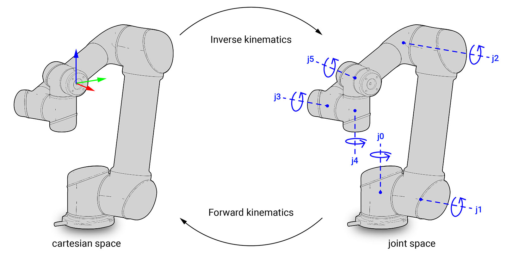

.. _forward_kinematics:

*******************************************************************************
Forward Kinematics
*******************************************************************************

When the state of the robot is known (Joint configuration and the robot base frame),
the link positions and orientations can be calculated. This process is called
forward kinematics. The forward kinematics problem is defined as follows:
given the set of joint positions (angles for revolute joints and displacements
for prismatic joints), find the pose of each link in the robot.

.. currentmodule:: compas_robots.model

Solving the forward kinematics problem allows us to determine the Link coordinate
frame (LCF) of each link, which are important for locating the robot in 3D space.
It is the first step in many operations, such as when visualizing
the robot, and for calculating the pose of attached tools and rigid bodies.

As such, forward kinematics is often performed automatically by other functions
in **COMPAS FAB**. However, it is also possible to calculate the forward kinematics
manually. The forward kinematics function for a robot is essentially the
:ref:`kinematic description of the robot<kinematic_model>`, which is represented by Links and Joints
in the :class:`~compas_robots.RobotModel`. In its general form, the forward kinematics function
require a full :class:`compas_robots.Configuration` as input and creates a list of
:class:`Frames<compas.geometry.Frame>` as output, each representing the pose of a link in the robot.
**COMPAS FAB** provides a few functions to calculate the forward kinematics of a robot:

#. :meth:`compas_robots.RobotModel.transformed_frames` calculates the pose for all the links
   in the robot model, results are relative to the Robot Coordinate Frame (RCF)
#. :meth:`compas_robots.RobotModel.forward_kinematics` calculates the pose to one specific link,
   results are relative to the Robot Coordinate Frame (RCF)
#. :meth:`compas_fab.robots.RobotCell.forward_kinematics_target_frame` calculates the pose of a target
   frame for a specific planning group, this can be the PCF, TCF or OCF depending on
   the choice of the target mode. The result is relative to the World Coordinate Frame (WCF)
#. :meth:`compas_fab.robots.RobotCell.compute_attach_objects_frames` calculates the pose for all the
   attached objects in the robot cell, results are relative to the World Coordinate
   Frame (WCF)
#. :meth:`compas_fab.backends.interfaces.PlannerInterface.forward_kinematics` calculates the pose of the
   target_frame for a specific planning group, the result is relative to the World Coordinate Frame (WCF)
   This function calls the forward kinematics function from a planning backend.

The following example shows how to calculate forward kinematics using only the RobotModel:

.. literalinclude :: files/04_forward_kinematics_urdf.py
   :language: python

