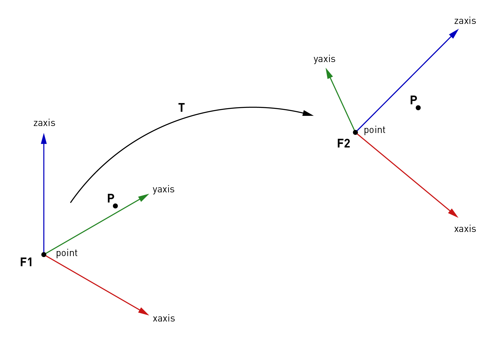

********************************************************************************
Frame and Transformation
********************************************************************************

.. currentmodule:: compas_fab.geometry

:class:`Frame` and :class:`Transformation` are two basic classes in the compas library and
can be used to describe position/orientation and coordinate systems. The
:class:`Frame` consists of a point and and two orthonormal base vectors (xaxis,
yaxis). :class:`Transformation` is the base class for transformations like
:class:`Rotation`, :class:`Translation`, :class:`Scale`, :class:`Reflection`,
:class:`Projection` and :class:`Shear`.

Here is a simple example of how to use Frame and Transformation: We want to
bring a point P in the coordinate system of frame F1 into the coordinate system
of frame F2.

.. code-block:: python

    from compas.geometry import Point
    from compas.geometry import Frame
    from compas.geometry.xforms import Transformation

    point =  [0.0, 0.0, 63.0]
    xaxis =  [1.0, 0.0, 0.0]
    yaxis =  [0.0, 1.0, 0.0]

    F1 = Frame(point, xaxis, yaxis)

    point =  [146.00, 150.00, 161.50]
    xaxis =  [0.9767, 0.0010, -0.214]
    yaxis =  [0.1002, 0.8818, 0.4609]

    F2 = Frame(point, xaxis, yaxis)

    P = Point(35., 35., 35.) # point in frame F1

    # bring P into worldXY frame.
    Tw = Transformation.from_frame_to_frame(Frame.worldXY(), F1)
    Pw = P.transformed(Tw)

    # bring Pw into frame F2
    T = Transformation.from_frame_to_frame(F1, F2)
    Pt1 = Pw.transformed(T)
    print(Pt1)

    # This here yields to the same result
    Pt2 = F2.represent_in_global_coordinates(P)
    print(Pt2)

From the frame, or resp. from the orientation (:class:`Rotation`) of the frame,
several other representations of rotation can be derived, such
as Euler angles, axis-angle representation, and quaternion.

.. code-block:: python

    from compas.geometry import Frame
    from compas.geometry.xforms import Rotation

    F1 = Frame([0, 0, 0], [0.68, 0.68, 0.27], [-0.67, 0.73, -0.15])

    # euler angles
    args = False, 'xyz'
    alpha, beta, gamma = F1.euler_angles(*args)

    # check if angles are correct
    xaxis, yaxis, zaxis = [1, 0, 0], [0, 1, 0], [0, 0, 1]
    Rx = Rotation.from_axis_and_angle(xaxis, alpha)
    Ry = Rotation.from_axis_and_angle(yaxis, beta)
    Rz = Rotation.from_axis_and_angle(zaxis, gamma)
    F2 = Frame.worldXY()
    F1 == F2.transformed(Rx * Ry * Rz)

    # quaternion
    q = F1.quaternion
    F2 = Frame.from_quaternion(q)
    F1 == F2

    # axis-angle
    ax = F1.axis_angle_vector
    F2 = Frame.from_axis_angle_vector(ax)
    F1 == F2

Further information:

* `Rotation <https://en.wikipedia.org/wiki/Rotation>`_
* `Euler angles <https://en.wikipedia.org/wiki/Euler_angles>`_
* `Quaternion <https://en.wikipedia.org/wiki/Quaternion>`_
* `Axis–angle representation <https://en.wikipedia.org/wiki/Axis%E2%80%93angle_representation>`_

