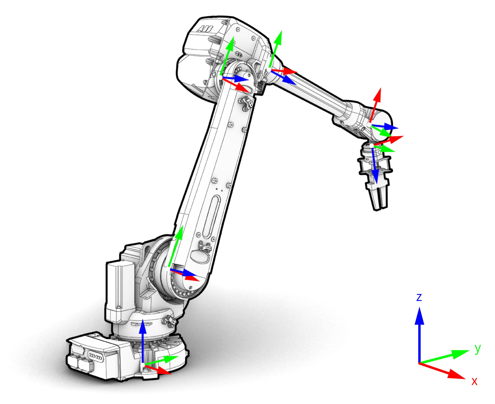

.. _kinematic_model:

*******************************************************************************
Kinematic model
*******************************************************************************

A kinematic model describes the motion of a robot in mathematical form without
considering the forces that affect motion and concerns itself with the
geometric relationship between elements.

In the kinematic model of a robot, the connection of different manipulator
joints is known as **link**, and the integration of two or more links is called
a **joint**. This kinematic model can be represented as a tree structure. The
tree describes the kinematic chain, i.e., the connection of robotic links with
joints, and the inter-dependendencies of these links. This tree structure plus
the underlying geometric information can be defined in Unified Robot
Description Format (URDF), which describes any robot (see for example
`UR5 URDF`_). If the robot is mounted on external axes, these links and joints
can be added as well.

.. figure:: files/01_robot_links_and_joints.jpg
    :figclass: figure
    :class: figure-img img-fluid

    An industrial robot's links and joints, and the according tree structure
    describing the kinematic model.

.. Actually it would be good to have here a robot on a linear axis...

.. _UR5 URDF: https://github.com/ros-industrial/universal_robot/blob/kinetic-devel/ur_description/urdf/ur5.urdf.xacro

Links
=====

Robot links are solid mechanical elements. Depending on the kinematic model,
movement of certain input links allows the output links to move at various
motions.

Joints
======

The joints are the elements in a robot which helps the links to travel in
different kind of movements. The three major types of joints are:

* **Revolute**: A hinge joint that rotates along the axis and has a limited
  range specified by the upper and lower limits.
* **Prismatic**: A sliding joint that slides along the axis, and has a limited
  range specified by the upper and lower limits.
* **Fixed**: Not really a joint because it cannot move, all degrees of freedom
  are locked.

**COMPAS** Framework provides classes to describe robot models. The following
snippet shows how to describe a UR5 robot:

.. code-block:: python

    from compas_robots import RobotModel
    from compas_robots.model import Joint
    from compas_robots.model import Link

    robot = RobotModel('ur5',
                  joints=[
                      Joint('shoulder_pan_joint', 'revolute', parent='base_link', child='shoulder_link'),
                      Joint('shoulder_lift_joint', 'revolute', parent='shoulder_link', child='upper_arm_link'),
                      Joint('elbow_joint', 'revolute', parent='upper_arm_link', child='forearm_link'),
                      Joint('wrist_1_joint', 'revolute', parent='forearm_link', child='wrist_1_link'),
                      Joint('wrist_2_joint', 'revolute', parent='wrist_1_link', child='wrist_2_link'),
                      Joint('wrist_3_joint', 'revolute', parent='wrist_2_link', child='wrist_3_link'),
                  ], links=[
                      Link('base_link'),
                      Link('shoulder_link'),
                      Link('upper_arm_link'),
                      Link('forearm_link'),
                      Link('wrist_1_link'),
                      Link('wrist_2_link'),
                      Link('wrist_3_link'),
                  ])
    print(robot)

    Coordinate frames in each joint of the robot.

Links
=====

* `ROS Wiki: URDF Tutorial <https://wiki.ros.org/urdf/Tutorials/Create%20your%20own%20urdf%20file>`_
* `Create your own URDF file <https://www.codemade.io/create-your-own-urdf-file/>`_
