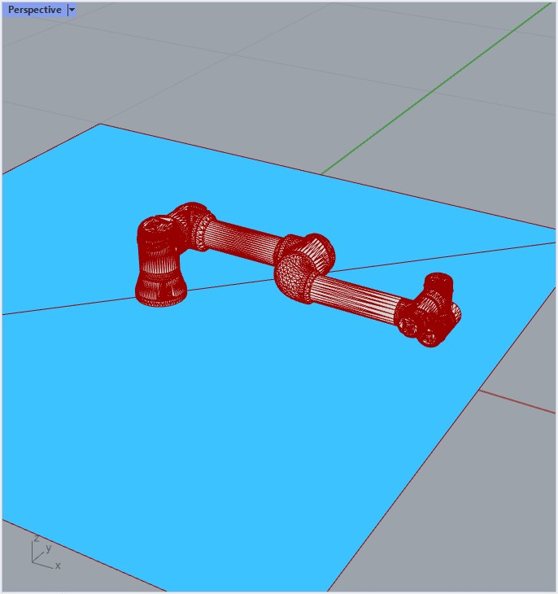
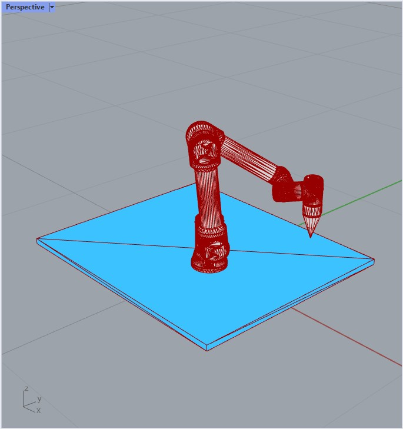

*******************************************************************************
Planning scene and collision objects
*******************************************************************************

.. note::

    The following examples use the `ROS <https://www.ros.org/>`_ backend
    and the MoveI! planner for UR5 robots. Before running them, please
    make sure you have the :ref:`ROS backend <ros_backend>` correctly
    configured and the :ref:`UR5 Demo <ros_bundles_list>` started.

To plan motion paths that avoid collisions with other objects than the robot
itself, the backend's planning scene has to be updated.

This is the representation of the planning scene in RViz with the UR5.

.. figure:: files/05_collision_objects_attached_without.jpg
    :figclass: figure
    :class: figure-img img-fluid

.. note::

    If using Docker to run ROS, you can open
    `RViz on your browser <http://localhost:8080/vnc.html?resize=scale&autoconnect=true>`_.

Collision meshes
================

The following script adds and then removes a floor to the planning scene.

.. literalinclude :: files/05_add_collision_mesh.py
   :language: python

The backend's updated planning scene while executing the above script.

The following script adds several boxes (bricks) to the planning scene. Here,
we use ``append`` instead of ``add`` to have multiple collision objects
clustered under the same identifier. Like that, we don't need to keep track of
all identifiers when we later remove them.

.. literalinclude :: files/05_append_collision_meshes.py
   :language: python

The backend's updated planning scene while executing the above script. Note the
red robot link indicating the collision.

.. figure:: files/05_collision_objects_append.jpg
    :figclass: figure
    :class: figure-img img-fluid

Attach tool to a robot's end-effector
=====================================

The following script defines a tool, described by a collision mesh and a frame, and
attaches and removes it to the robot's end-effector.

.. literalinclude :: files/05_attach_mesh_to_ee.py
   :language: python

The backend's updated planning scene while executing the above script.

