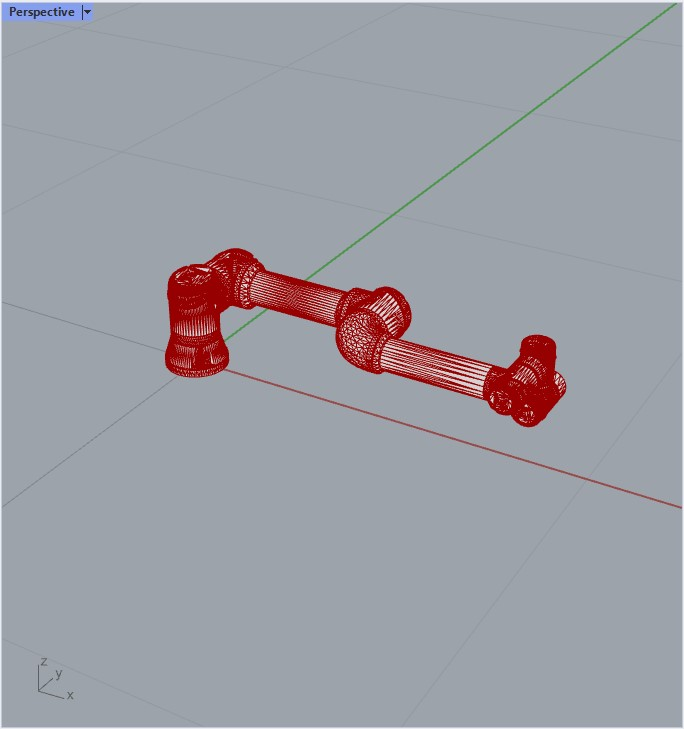
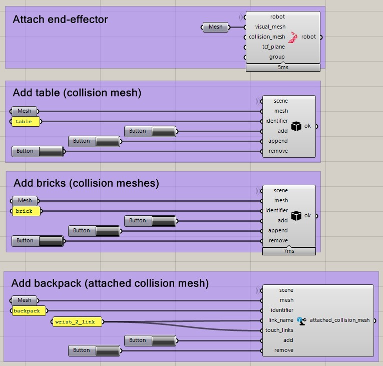

*******************************************************************************
Planning scene and collision objects
*******************************************************************************

.. note::

    The following examples use the `ROS <https://www.ros.org/>`_ backend
    and the MoveIt! planner for UR5e robots. Before running them, please
    make sure you have the :ref:`ROS backend <ros_backend>` correctly
    configured and the :ref:`UR5e Demo <ros_bundles_list>` started.

There are two types of collision meshes:
    1. Non-attached collision meshes
    2. Attached collision meshes

To plan motion paths that avoid collisions with other objects than the robot
itself, the backend's planning scene has to be updated.

After the planner starts, the scene will only contain the robot:

1. Non-attached Collision meshes
================================

Add/remove a single mesh
------------------------

The following script adds and then removes a floor to the planning scene.

.. literalinclude :: files/05_add_collision_mesh.py
   :language: python

The backend's updated planning scene while executing the above script.

.. figure:: files/05_collision_objects.jpg
    :figclass: figure
    :class: figure-img img-fluid

Add/remove several meshes
-------------------------

The following script adds several boxes (bricks) to the planning scene. Here,
we use ``append`` instead of ``add`` to have multiple collision objects
clustered under the same identifier. Like that, we don't need to keep track of
all identifiers when we later remove them.

.. literalinclude :: files/05_append_collision_meshes.py
   :language: python

The backend's updated planning scene while executing the above script.

.. figure:: files/05_collision_objects_append.jpg
    :figclass: figure
    :class: figure-img img-fluid

2. Attached collision meshes
============================

Attach end-effector
-------------------

The following script defines a tool -also called end effector- which is described by a collision mesh and a frame, and
attaches it to the robot.

.. literalinclude :: files/05_attach_ee.py
   :language: python

In this case, we are not adding it to the planning scene explicitely, only attaching it to the robot instance itself.

.. figure:: files/05_collision_objects_attached.jpg
    :figclass: figure
    :class: figure-img img-fluid

Grasshopper example
===================

The following Grasshopper document showcases all the options described above:

.. raw:: html

    

    

    
Download

* :download:`Robot playground (Grasshopper) (.GHX) <files/05_grasshopper_collision_objects.ghx>`

.. raw:: html

    

    

