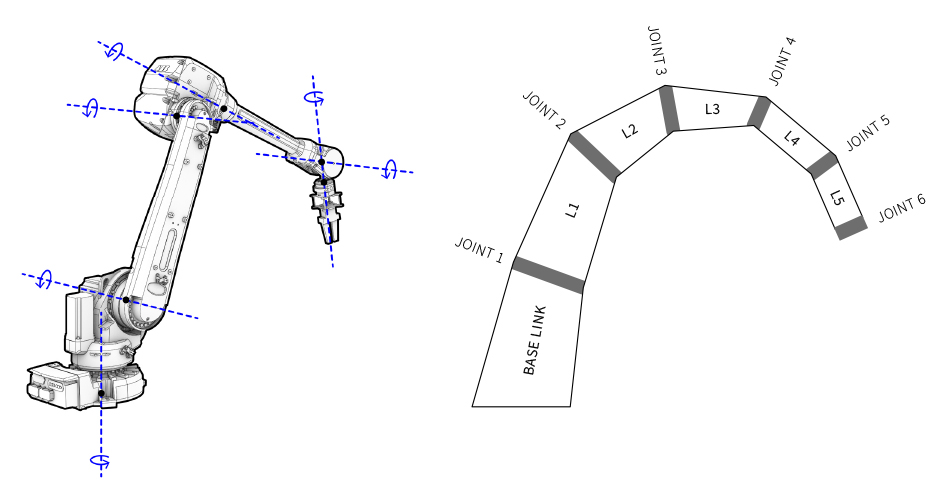

********************************************************************************
Kinematic model
********************************************************************************

A kinematic model describes the motion of a robot in mathematical form without
considering the forces that affect motion and concerns itself with the geometric
relationship between elements.

In the kinematic model of a robot, the connection of different manipulator
joints is known as **link**, and the integration of two or more links is called
a **joint**. This kinematic model can be represented as a tree structure. The tree
describes the kinematic chain, i.e., the connection of robotic links with
joints, and the inter-dependendencies of these links. This tree structure plus
the underlying geometric information can be defined in Unified Robot
Description Format (URDF), which describes any robot (see for example
UR5urdf_). If the robot is mounted on external axes, these links and joints
can be added as well.

    An industrial robot's links and joints, and the according tree structure
    describing the kinematic model.

.. Actually it would be good to have here a robot on a linear axis...

In ROS, the RobotModel_ and RobotState_ classes are the core classes that
give you access to a robot's kinematics.

.. _RobotModel: https://docs.ros.org/kinetic/api/moveit_core/html/classmoveit_1_1core_1_1RobotModel.html
.. _RobotState: https://docs.ros.org/kinetic/api/moveit_core/html/classmoveit_1_1core_1_1RobotState.html
.. _UR5urdf: https://github.com/ros-industrial/universal_robot/blob/kinetic-devel/ur_description/urdf/ur5.urdf.xacro

Links
==================

Robot links are solid mechanical elements. Depending on the kinematic model, movement
of certain input links allows the output links to move at various motions.

Joints
==================

The joints are the elements in a robot which helps the links to travel in different
kind of movements. The three major types of joints are:

* **Revolute**: A hinge joint that rotates along the axis and has a limited range specified by the upper and lower limits
* **Prismatic**: A sliding joint that slides along the axis, and has a limited range specified by the upper and lower limits
* **Fixed**: Not really a joint because it cannot move, all degrees of freedom are locked.

**COMPAS** Framework provides classes to describe robot models. The following snippet shows how to describe a UR5 robot:

.. code-block:: python

    from compas.robots import Robot
    from compas.robots import Joint
    from compas.robots import Link

    robot = Robot('ur5',
                  joints=[
                      Joint('shoulder_pan_joint', 'revolute', parent='base_link', child='shoulder_link'),
                      Joint('shoulder_lift_joint', 'revolute', parent='shoulder_link', child='upper_arm_link'),
                      Joint('elbow_joint', 'revolute', parent='upper_arm_link', child='forearm_link'),
                      Joint('wrist_1_joint', 'revolute', parent='forearm_link', child='wrist_1_link'),
                      Joint('wrist_2_joint', 'revolute', parent='wrist_1_link', child='wrist_2_link'),
                      Joint('wrist_3_joint', 'revolute', parent='wrist_2_link', child='wrist_3_link'),
                  ], links=[
                      Link('base_link'),
                      Link('shoulder_link'),
                      Link('upper_arm_link'),
                      Link('forearm_link'),
                      Link('wrist_1_link'),
                      Link('wrist_2_link'),
                      Link('wrist_3_link'),
                  ])
    print(robot)

.. figure:: 03_robot_model.jpg
    :figclass: figure
    :class: figure-img img-fluid w-50

    Coordinate frames in each joint of the robot.

Forward Kinematics
==================

The Forward Kinematics function/algorithm takes the joint states, or configuration,
as the input, and calculates the pose of the end effector in the task space
as the output. This means the state of each joint in the articulated body
of a robot needs to be defined.

Joint states are described in **compas_fab** with the
:class:`compas_fab.robots.Configuration` class.

.. code-block:: python

    config = Configuration.from_revolute_values(to_radians([90, 90, 0, 0, 0, 0]))

    with VrepClient() as client:
        client.set_robot_config(robot, config)

        frame = client.get_end_effector_pose(robot)
        print('End effector pose: ', str(frame))

Inverse Kinematics
==================

Inverse Kinematics is the inverse function/algorithm of Forward Kinematics. The
Forward Kinematics function/algorithm takes a target end-effector pose in the
task space as the input, and calculates the joint states required for the
end effector to reach the target pose . The output of an inverse kinematics
are the joint states, i.e. the configuration of the robot.

The following code exemplifies how to calculate this:

.. code-block:: python

    goal_pose = Frame((8.110, 7.020, 1.810), (-1, 0, 0), (-0, -0, -1))

    with VrepClient() as client:
        config = client.set_robot_pose(rfl.Robot('B'), goal_pose)
        print('Found configuration: ', str(config))

Visualizing robot models
========================

**COMPAS** includes the concept of `artists`: classes that assist with the
visualization of datastructures and models, in a way that maintains the data
separated from the specific CAD interfaces, while providing a way to leverage
native performance of the CAD environment.

In the main library there are artists for various datastructures (meshes, networks,
etc), and **compas_fab** adds a ``RobotArtist`` to them. Robot artists allow
visualizing robot models easily and efficiently.

The following example illustrates how to load an entire robot model from an open source
repository and render it in Rhino:

.. literalinclude :: files/robot-artist-rhino.py
   :language: python

.. raw:: html

    

    

    
Downloads

* :download:`Robot artist (Rhino) (.PY) <files/robot-artist-rhino.py>`
* :download:`Robot artist (Blender) (.PY) <files/robot-artist-blender.py>`

.. raw:: html

    

    

Links
=====

* `ROS Wiki: URDF Tutorial <https://wiki.ros.org/urdf/Tutorials/Create%20your%20own%20urdf%20file>`_
* `Create your own URDF file <https://www.codemade.io/create-your-own-urdf-file/>`_

