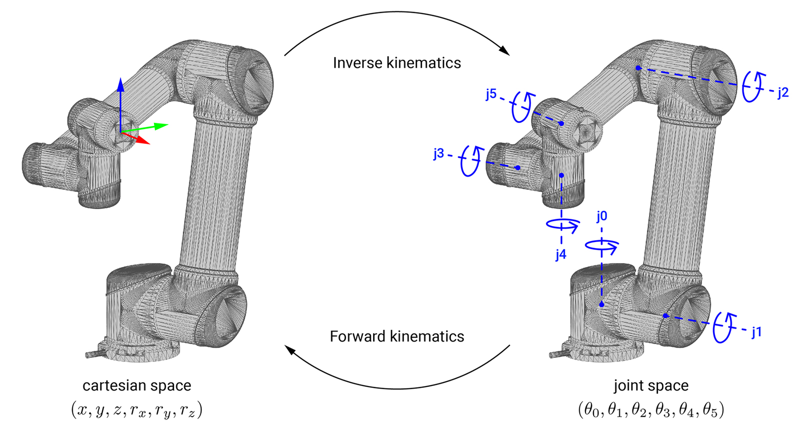

********************************************************************************
Forward and inverse kinematics
********************************************************************************

Forward kinematics
==================

The forward kinematics function calculates the pose of the robot's end-effector
from joint states (cartesian space to joint space). This means the state of each
joint in the articulated body of a robot needs to be defined.

Joint states are described in **COMPAS FAB** with the
:class:`compas_fab.robots.Configuration` class.

.. code-block:: python

    from compas_fab.backends import RosClient
    from compas_fab.robots import Configuration
    from compas_fab.robots.ur5 import Robot

    with RosClient() as client:

        robot = Robot(client)
        configuration = Configuration.from_revolute_values([-2.238, -1.153, -2.174, 0.185, 0.667, 0.])

        response = robot.forward_kinematics(configuration)

        print("Frame in the robot's coordinate system", response.frame_RCF)
        print("Frame in the world coordinate system", response.frame_WCF)

Inverse kinematics
==================

Inverse kinematics is the inverse function of forward kinematics. The
inverse kinematics function calculates the joint states required for the
end-effector to reach a certain target pose (joint space to cartesian space).

The following code exemplifies how to calculate this:

.. code-block:: python

    from compas.geometry import Frame
    from compas_fab.backends import RosClient
    from compas_fab.robots.ur5 import Robot

    with RosClient() as client:

        robot = Robot(client)

        frame_WCF = Frame([0.3, 0.1, 0.5], [1, 0, 0], [0, 1, 0])
        start_configuration = robot.init_configuration()

        configuration = robot.inverse_kinematics(frame_WCF, start_configuration)

        print("Found configuration", configuration)
