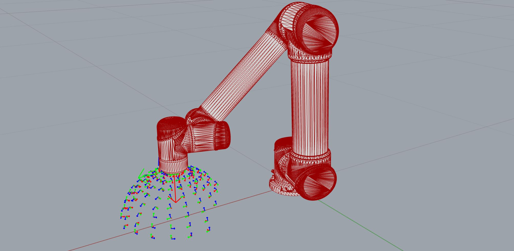

*******************************************************************************
Introduction to the Reachability Map
*******************************************************************************

For workspace planning or robot path planning, it is useful to calculate and
visualize the space of the robot's reachability, depending on its attached tool,
obstacles in the environment and its own kinematic and geometric constraints.

The ``ReachabilityMap`` is a collection of all valid IK solutions, i.e. poses that the end-effector can reach, at specified locations. The map is built by discretizing the robot's environment, defining frames to be checked, and calculating the IK solutions for each frame.

The creation of this map depends on the availability of an analytical inverse
kinematic solver for the used robot. Please checkout the kinematic backend for
available robots.

Links
=====
* `Realuex (ROS's reachability map) <http://wiki.ros.org/reuleaux>`_

Example 01: reachability map 1D
===============================

Let's consider the following (abstract) example:

We have a UR5 and want the TCP of the robot to always orient itself towards a
defined position in front of the robot. Therefore, we define a (half-)sphere
with a certain radius and we evaluate points on this sphere. At each point, we then
create a plane whose normal vector points towards the center of this sphere. From these planes
we create frames for the robot's TCP. The function is written as a generator
because the ``ReachabilityMap`` takes a ``Frame`` generator as input.

.. figure:: files/00_robot_halfsphere.jpg
    :figclass: figure
    :class: figure-img img-fluid

.. code-block:: python

    # 1. Define frames on a sphere
    sphere = Sphere((0.4, 0, 0), 0.15)

    def points_on_sphere_generator(sphere):
        for theta_deg in range(0, 360, 20):
            for phi_deg in range(0, 90, 10):  # only half-sphere
                theta = math.radians(theta_deg)
                phi = math.radians(phi_deg)
                x = sphere.point.x + sphere.radius * math.cos(theta) * math.sin(phi)
                y = sphere.point.y + sphere.radius * math.sin(theta) * math.sin(phi)
                z = sphere.point.z + sphere.radius * math.cos(phi)
                point = Point(x, y, z)
                axis = sphere.point - point
                plane = Plane((x, y, z), axis)
                f = Frame.from_plane(plane)
                # for UR5 is zaxis the xaxis
                yield Frame(f.point, f.zaxis, f.yaxis)

Then we create a ``PyBulletClient`` (for collision checking), load the UR5 robot,
set the analytical IK solver and define options for the IK solver.
For simplicity, we do not add any tool or obstacles in the environment here, but in a
real robot cell, this will usually be the case.

.. code-block:: python

    # 2. Set up robot cell

    with PyBulletClient(connection_type='direct') as client:
        # load robot and define settings
        robot = client.load_ur5(load_geometry=True)
        ik = AnalyticalInverseKinematics(client)
        client.inverse_kinematics = ik.inverse_kinematics
        options = {"solver": "ur5", "check_collision": True, "keep_order": True}

Now we create a ``ReachabilityMap``. We calculate it passing the ``Frame``
generator, the robot and the IK options. After calculation, we save the map as
json for later visualization in Rhino/GH.

.. code-block:: python

        # 3. Create reachability map 1D

        map = ReachabilityMap()
        map.calculate(points_on_sphere_generator(sphere), robot, options)
        # save to json
        map.to_json(os.path.join(DATA, "reachability", "map1D.json"))

`Link to full script <files/01_example_1D.py>`_

Visualization
=============

In Grasshopper, we can source the reachability map from the json file and use
the ``ReachabilityMapArtist`` to visualize the saved frames by using the
artist's function ``draw_frames``.

.. code-block:: python

    map = ReachabilityMap.from_json(filepath)
    artist = ReachabilityMapArtist(map)
    frames = artist.draw_frames()

.. figure:: files/00_robot_halfsphere.jpg
    :figclass: figure
    :class: figure-img img-fluid

By default, the ``artist.draw()`` method returns points and colors for a point cloud,
where the points are the positions of the frames and the colors are calculated
from the score at the respective frame. The ``ReachabilityMap.score`` is
the number of valid IK solutions for a frame. The default colormap is 'viridis'.

In the example below, the highest score is 4 (yellow) and the lowest score is 2 (violet).

.. figure:: files/01_robot_map1D.jpg
    :figclass: figure
    :class: figure-img img-fluid

If you want to visualize the frames at a specific IK index (= number between 0-7), use the method
``artist.draw_frames_at_ik_index(ik_index)``. If you compare the figure below
with the figure of ``draw_frames``, you will see that a certain portion is not
reachable at the selected IK index.

Projects where the reachability map was applied
===============================================

------------------------------------------------------------------------------------------
`Adaptive Detailing <https://gramaziokohler.arch.ethz.ch/web/forschung/e/0/0/0/361.html>`_
------------------------------------------------------------------------------------------

In this project, connections between structural elements are 3D printed in place,
directly on top of parts, i.e. collision objects. A ``ReachabilityMap`` was created
to capture the space where connections can be placed and ultimately find connecting
geometries that the robot can print in between these objects. Printing process
constraints can be included in the reachability map by choosing a meaningful
``max_alpha`` in the ``DeviationVectorsGenerator``.

.. figure:: files/adaptive_detailing.png
    :figclass: figure
    :class: figure-img img-fluid

------------------------------------------------------------------------------------------
`Robotic 360° Light Painting Workshop <https://gramaziokohler.arch.ethz.ch/web/lehre/e/0/0/0/439.html>`_
------------------------------------------------------------------------------------------

This project served as inspiration for the presented examples 01-03. The robot TCP
had to be oriented towards the 360° camera. The light paths were mapped on a hemisphere
to maintain equal distance to the camera and little distortion of the designed paths.
The reachability map was used to determine the best position and radius for the
sphere with the UR5e robot model, the light tool, and the camera and tripods as
collision objects.

