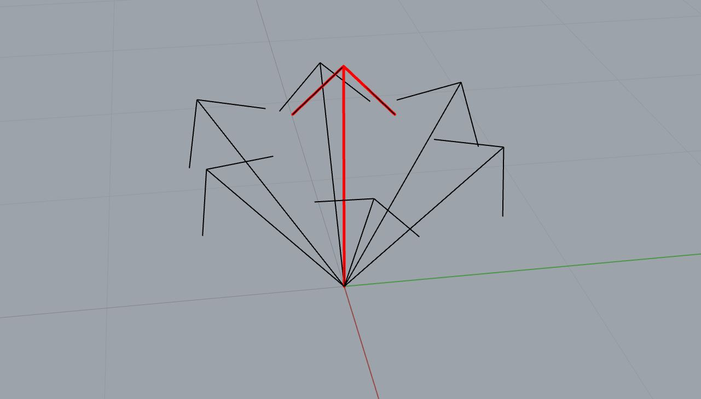

*******************************************************************************
Vector Generators
*******************************************************************************

For using the ``ReachabilityMap`` we need a ``Frame`` generator function. In a
simple case, this can be only a list of frames. However, sometimes it makes
sense to generate multiple frames at a certain location that deviate a bit in
orientation. We provide 2 helper vector generators with very verbose names:

* ``OrthonormalVectorsFromAxisGenerator``
* ``DeviationVectorsGenerator``

Generate orthonormal vectors from an axis
=========================================

The ``OrthonormalVectorsFromAxisGenerator`` generates vectors that are orthonormal a given axis.

In the example below, the given axis is visualized in red, and the generated vectors in black.

.. figure:: files/03_ortho_vectors.jpg
    :figclass: figure
    :class: figure-img img-fluid

>>> import math
>>> from compas.geometry import Vector
>>> from compas_fab.robots import OrthonormalVectorsFromAxisGenerator
>>> zaxis = Vector(0, 0, 1)
>>> max_alpha = 60
>>> for xaxis in OrthonormalVectorsFromAxisGenerator(zaxis, math.radians(max_alpha)):
...     print(xaxis)
Vector(0.000, -1.000, 0.000)
Vector(0.866, -0.500, 0.000)
Vector(0.866, 0.500, 0.000)
Vector(0.000, 1.000, 0.000)
Vector(-0.866, 0.500, 0.000)
Vector(-0.866, -0.500, 0.000)

Generate vectors that deviate
=============================

The ``DeviationVectorsGenerator`` generates equally distributed vectors that deviate from the passed one by a maximal angle of max_alpha.

In the example below, the given axis is visualized in red, and the generated vectors in black.

>>> import math
>>> from compas_fab.robots import DeviationVectorsGenerator
>>> zaxis = Vector(0, 0, 1)
>>> max_alpha = 40
>>> step = 1
>>> for axis in DeviationVectorsGenerator(zaxis, math.radians(max_alpha), step):
...     print(axis)
Vector(0.000, 0.000, 1.000)
Vector(-0.643, 0.000, 0.766)
Vector(-0.321, -0.557, 0.766)
Vector(0.321, -0.557, 0.766)
Vector(0.643, -0.000, 0.766)
Vector(0.321, 0.557, 0.766)
Vector(-0.321, 0.557, 0.766)

Or another example with using ``max_angle = 60`` and ``step = 2``.

.. figure:: files/05_devi_vectors_2.jpg
    :figclass: figure
    :class: figure-img img-fluid

Generate frames
===============

Now having these two vector generators, we can combine them for generating frames.

.. code-block:: python

    from compas.geometry import Frame
    from compas.geometry import Point
    from compas.geometry import Vector
    from compas_fab.robots import DeviationVectorsGenerator
    from compas_fab.robots import OrthonormalVectorsFromAxisGenerator

    def frame_generator():
        for i in range(6):
            pt = Point(0, 0, 0) + Vector(0, i, 0)
            zaxis = Vector(0, 0, 1)
            for axis in DeviationVectorsGenerator(zaxis, math.radians(40), 1):
                for xaxis in OrthonormalVectorsFromAxisGenerator(axis, math.radians(60)):
                    yaxis = axis.cross(xaxis)
                    yield Frame(pt, xaxis, yaxis)

.. figure:: files/06_devi_frames.jpg
    :figclass: figure
    :class: figure-img img-fluid
