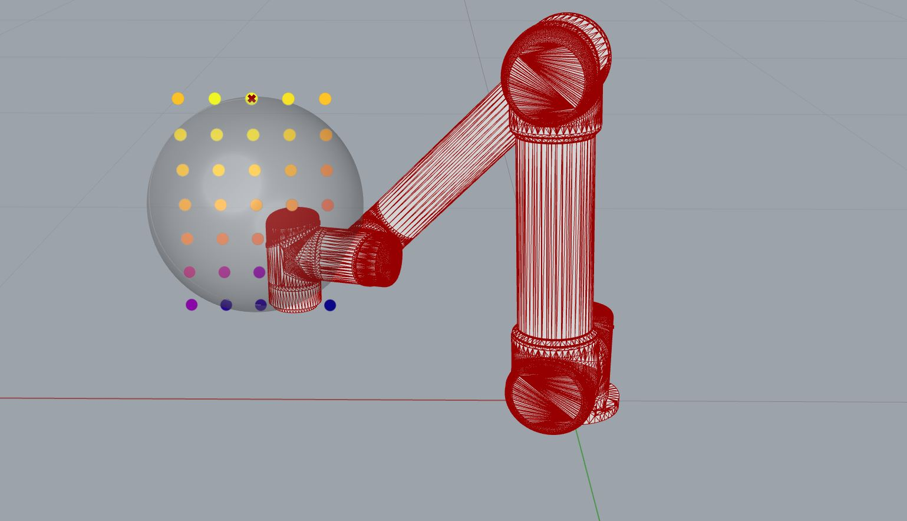

*******************************************************************************
Reachability Map 2D
*******************************************************************************

The example in the introduction used a list of frames on specific points on the sphere to calculate the reachability map (1D).
For the next two examples, we want to generate a list of a list of frames and use
these for the calculation (2D).

Example 02: reachability map 2D with deviation vectors
======================================================

Additionally to the ``points_on_sphere_generator`` from Example 01, we create a
``deviation_vector_generator``.

.. code-block:: python

    import math
    from compas.geometry import Frame
    from compas_fab.robots import DeviationVectorsGenerator

    def deviation_vector_generator(frame):
        for xaxis in DeviationVectorsGenerator(frame.xaxis, math.radians(40), 1):
            yaxis = frame.zaxis.cross(xaxis)
            yield Frame(frame.point, xaxis, yaxis)

And combine both generators into a generator that yields a list of a list of frames (2D).

.. code-block:: python

    def generator():
        for frame in points_on_sphere_generator(sphere):
            yield deviation_vector_generator(frame)

The robot is set up as in Example 01 and we calculate the reachability map as follows.

>>> map = ReachabilityMap()                                                      # doctest: +SKIP
>>> map.calculate(generator(), robot, options)                                   # doctest: +SKIP
>>> map.to_json(os.path.join(DATA, "reachability", "map2D_deviation.json"))      # doctest: +SKIP

The visualization of the results in Rhino/GH looks different than in Example 01, as the scores per evaluated point are now more scattered and range between 16 (dark purple) and 26 (yellow).

.. figure:: files/07_example_02.jpg
    :figclass: figure
    :class: figure-img img-fluid

`Link to full script <files/02_example_2D_deviation_vectors.py>`__

Example 03: reachability map 2D with sphere points
==================================================

In this example, we want to know the best reachable sphere from Example 01.
Therefore, we create a sphere generator:

.. code-block:: python

    from compas.geometry import Sphere
    from compas.geometry import Vector

    def sphere_generator():
        sphere = Sphere((0.35, 0, 0), 0.15)
        for x in range(5):
            for z in range(7):
                center = sphere.point + Vector(x, 0, z) * 0.05
                yield Sphere(center, sphere.radius)

.. figure:: files/08_example_03_spheres.jpg
    :figclass: figure
    :class: figure-img img-fluid

And use it together with the ``points_on_sphere_generator`` to create a 2D frame generator.

.. code-block:: python

    def generator():
        for sphere in sphere_generator():
            yield points_on_sphere_generator(sphere)

In this case, we actually evaluate 5705 (= 35 x 163) frames, see figure below.

.. figure:: files/09_example_03_frames.jpg
    :figclass: figure
    :class: figure-img img-fluid

We can easily check the shape of the reachability as follows:

>>> map.shape       # doctest: +SKIP
(35, 163)           # doctest: +SKIP

Visualizing the results in Rhino/GH gives an indication of the best position for
the tested spheres. The score ranges now from 436 to 937. We can ask the map for the
best score, returning the score and the index:

>>> map.best_score  # doctest: +SKIP
(937, 20)           # doctest: +SKIP

.. note::

    Please note that the points of the point cloud correspond to the first frame
    point of each of the 2D lists and NOT the sphere center. This can however be
    changed by passing the ``sphere_centers`` for the artist to override.

>>> points, colors = artist.draw(points=sphere_centers)   # doctest: +SKIP

.. figure:: files/10_example_03_result_override.jpg
    :figclass: figure
    :class: figure-img img-fluid

`Link to full script <files/03_example_2D_sphere_points.py>`__
