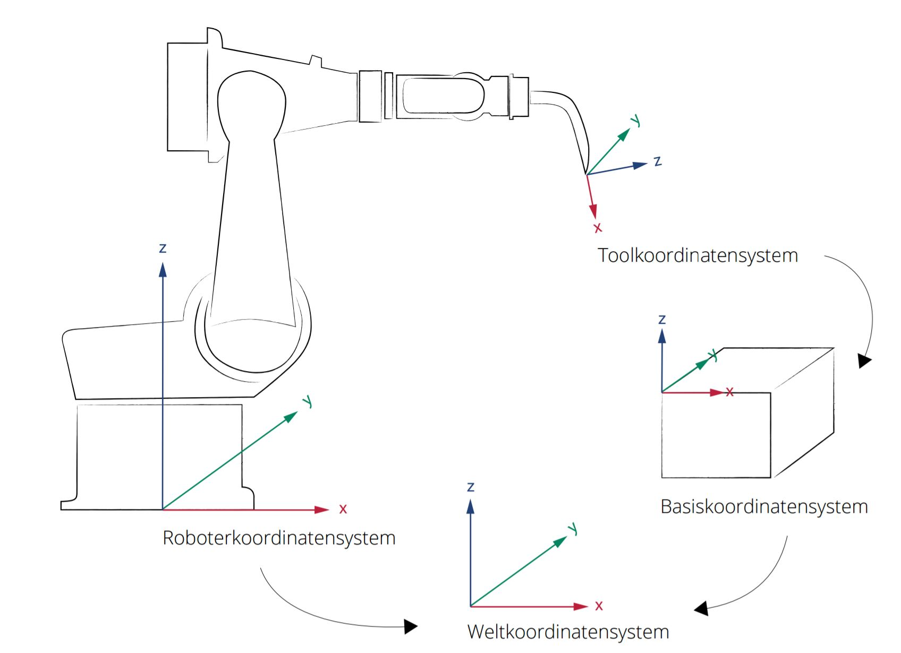

.. _examples_coordinate_systems:

********************************************************************************
Coordinate systems
********************************************************************************

.. contents::

The ``Frame`` class is used to describe coordinate systems or coordinate frames.
To plan robotic fabrication processes robotic targets and positions are located 
by measurements along the axes of different coordinate systems, for example:

* World coordinate system (WCS)
* Robot coordinate system (RCS)
* Tool coordinate system (TCS)
* Object coordinate system (OCS)

Map or world coordinate system (WCS)
==================
The world coordinate system (WCS) has its zero point on a fixed position with 
its Z-axis pointing upwards (= map in ROS convention). The WCS is useful for 
handling several robots or robots moved by external axes. By default the world 
coordinate system coincides with the robot coordinate system.

Base_link or robot coordinate system (RCS)
==================
The robot coordinate system (RCS) has its zero point in the base of the robot 
and is the reference system for the mechanical buildup of the robot (base_link
in ROS convention). It must be defined in reference to the WCS. 

Tool coordinate system (TCS)
==================
The tool coordinate system (TCS) has its origin at the tip of the tool (Tool 
Center Point: TCP). If the tool is moved, the TCS moves as well. It is dependent
on the RCS.

Object coordinate system (OCS)
==================
The object coordinate system (OCS) corresponds to the work object or the built
structure. It defines the placement of the work object in relation to the world 
coordinate system (WCS).

Links:
http://www.ros.org/reps/rep-0105.html#id15
http://developercenter.robotstudio.com/BlobProxy/manuals/IRC5FlexPendantOpManual/doc210.html

