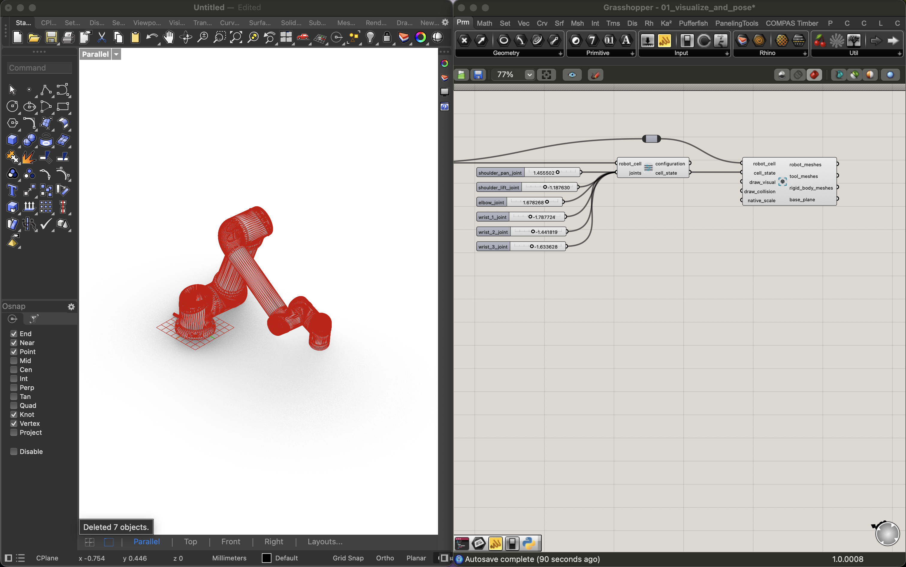

# Grasshopper

The COMPAS FAB Grasshopper components let you build robot cells, solve
kinematics, and plan motions on the canvas, the same data model and planning
backends as the Python API, wired visually. They're ideal for exploring poses
and targets interactively and for previewing trajectories in the Rhino viewport.

Install them from the Rhino Package Manager (search `compas_fab`); the
components then appear under the **COMPAS FAB** tab in the Grasshopper toolbar.
If you're *building* or modifying the components, see
[Extending compas_fab › Grasshopper components](../developer/grasshopper.md)
instead.

## The mental model

Two objects flow through almost every Grasshopper file, and keeping them straight is the
key to the components:

- **`RobotCell`**: the *models*: the robot, plus any tools and rigid bodies.
  Produced by a **Load Robot Cell** component.
- **`RobotCellState`**: the *configuration*: the robot's joint values and which
  tools / workpieces are attached where. Produced alongside the cell and then
  refined by the `Set …` and `Attach …` components.

A **planner** (Analytical, PyBullet, or MoveIt) consumes the cell and answers
kinematics & planning questions. **Visualize Robot Cell** draws a cell at a
given state. See [Concepts](../concepts.md) for the data model in depth.

!!! tip "Auto-wired inputs"
    Several components create their own helper widgets when an input is left
    unwired: **Load Robot Cell** drops a robot dropdown, target components a
    `target_mode` dropdown, and **ROS Client** a `connect` toggle. Just drop the
    component and go.

## First example: visualize and update robot pose

The "Hello world" of COMPAS FAB in Grasshopper: load a robot and move it with sliders. 
No backend server, no setup beyond the components.

**Load Robot Cell From Library** (`ur5`) → **Robot Configuration** (which
drops a slider per joint) → **Visualize Robot Cell**. Drag the sliders and the
robot moves live in the viewport.

[Download `01_visualize_and_pose.ghx`](ghpython/files/01_visualize_and_pose.ghx){: download="01_visualize_and_pose.ghx" }

## More examples

Each is a self-contained `.gh` file. Start at the top and work down — the
backends get progressively heavier (in-process → PyBullet → ROS).

### Kinematics (no server required)

- [`02_inverse_kinematics.gh`](ghpython/files/02_inverse_kinematics.gh){: download="02_inverse_kinematics.gh" }:
  solve **inverse kinematics** to a target plane with the in-process
  **Analytical Planner**: Load Robot Cell → Analytical Planner → Frame Target →
  Inverse Kinematics → Visualize. Move the target plane and watch the robot
  follow.

### Building a robot cell

- [`03_build_robot_cell.gh`](ghpython/files/03_build_robot_cell.gh){: download="03_build_robot_cell.gh" }:
  add a **tool** and a **rigid body** to a cell and attach the tool to the
  robot, then visualize the result. Shows the
  *load registers models → state attaches them* split.

### Motion planning

- [`04_plan_motion.gh`](ghpython/files/04_plan_motion.gh){: download="04_plan_motion.gh" }:
  plan a **free-space motion** with **MoveIt** over a ROS bridge: ROS Client →
  MoveIt Planner → Frame Target → Plan Motion, then **Deconstruct Trajectory**
  with an index slider to scrub the path through **Visualize Robot Cell**.
  Requires a running ROS + MoveIt backend ([set one up](../backends/ros.md)).
- [`05_plan_cartesian_motion.gh`](ghpython/files/05_plan_cartesian_motion.gh){: download="05_plan_cartesian_motion.gh" }:
  plan a **linear Cartesian path** through **Frame Waypoints** and preview the
  tool-tip polyline. The `planes`/`polyline` outputs follow the waypoints'
  `target_mode`.

### Putting it together

- [`kitchen_sink.gh`](ghpython/files/kitchen_sink.gh){: download="kitchen_sink.gh" }:
  a fuller canvas combining cell building, targets, planning, and visualization,
  for reference once the basics click.

## Troubleshooting

- **A component is red.** Hover its balloon for the message; the planning
  components also expose it on a `debug_info` output you can wire to a panel.
- **I updated compas_fab but the canvas didn't change.** Components cache their
  imports — **restart Rhino** after upgrading, and rebuild/reinstall the
  userobjects if you changed the components themselves.
- **Nothing draws / the robot is tiny.** Check your Rhino document units; the
  models are in metres, and the visualize / target components take a
  `native_scale` for non-metre documents.
