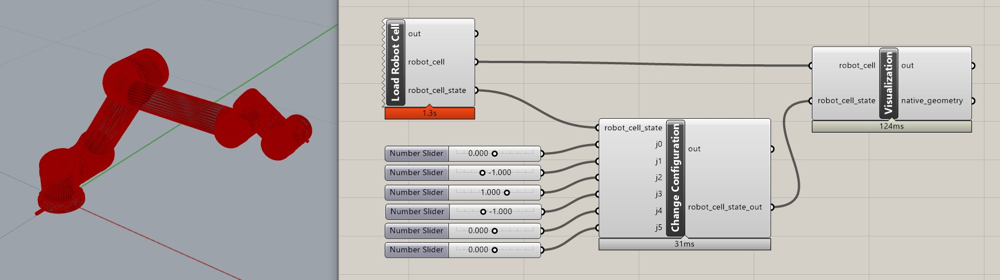

.. _gh_modify_configuration_interactively:

==============================================================
Interactively modify Robot Configuration and Visualization
==============================================================

The following example shows how to interactively modify the robot configuration
and visualize it in Grasshopper.

Because loading the robot cell and the initial draw by the visualization
function can take some time, this example splits the process into three
Custom Python components:

1. **Load Robot Cell**: This component loads the robot cell and its initial state.
2. **Modify Robot Configuration**: This component allows you to modify the robot's configuration interactively from slider inputs.
3. **Visualize Robot**: This component visualizes the robot with the modified robot_cell_state.

By splitting the workflow into these three components, the user can avoid
reloading the robot cell when changing the robot configuration.

    Three Custom Python components in Grasshopper to modify and visualize a robot configuration.

Load Robot Cell
==========================
The first component loads the robot cell from the `RobotCellLibrary`.

.. code-block:: python

    # r: compas_fab
    # venv: compas_fab
    from compas_fab.robots import RobotCellLibrary

    # Load the robot model
    robot_cell, robot_cell_state = RobotCellLibrary.ur5()

Modify Robot Configuration
==========================

The second component modifies the joint values of the default
robot configuration.
Note that we make a copy of the `robot_cell_state` before modifying it.
This avoid modifying the original state object that maybe connected to
other components in Grasshopper.

.. code-block:: python

    # venv: compas_fab

    robot_cell_state_out = robot_cell_state.copy()
    robot_cell_state_out.robot_configuration.joint_values[0] = j0
    robot_cell_state_out.robot_configuration.joint_values[1] = j1
    robot_cell_state_out.robot_configuration.joint_values[2] = j2
    robot_cell_state_out.robot_configuration.joint_values[3] = j3
    robot_cell_state_out.robot_configuration.joint_values[4] = j4
    robot_cell_state_out.robot_configuration.joint_values[5] = j5

Visualization with Cached Scene Object in Grasshopper
============================================================

The visualization component can be as simple as before by using the
`Scene` class from COMPAS and calling the `draw` method on the
`SceneObject`. A simple example consist of the following code:

.. code-block:: python

    # venv: compas_fab
    from compas.scene import Scene

    # Create a scene object for visualization
    scene = Scene()
    scene_object = scene.add(robot_cell)

    # Visualize the robot in the COMPAS Viewer or other CAD environment
    native_geometry = scene_object.draw(robot_cell_state)

However, this approach can be inefficient because the draw function
rebuilds the native geometry when it called the first time.
To improve performance, especially when the robot configuration changes frequently,
it is recommended to cache the scene object in the Grasshopper component
using the `scriptcontext.sticky` dictionary.
The subsequent modifications to the robot configuration can then reuse the cached
`SceneObject` without needing to redraw the entire robot model.
The code for the third component with caching looks like this:

.. code-block:: python

    # venv: compas_fab

    from scriptcontext import sticky
    from compas_ghpython import create_id
    from compas.scene import Scene

    # Create hash (scope limited to this component) for caching SceneObject
    object_hash = str(id(robot_cell))
    gh_component = ghenv.Component
    cache_id = create_id(gh_component, object_hash)

    # If scene object exist in sticky, retrieve it
    scene_object = None
    if sticky.has_key(cache_id):
        scene_object = sticky[cache_id]
        # Double check if the item is the same
        if scene_object.item is robot_cell:
            print("SceneObject '{}' reused for '{}'".format(type(scene_object).__name__, type(robot_cell).__name__))
        else:
            scene_object = None

    # Create Scene Object and cache it
    if scene_object is None:
        scene = Scene()
        scene_object = scene.add(robot_cell)
        print("SceneObject {} newly created for {}".format(type(scene_object).__name__, type(robot_cell).__name__))
        sticky[cache_id] = scene_object

    # The draw method is the same as before
    native_geometry = scene_object.draw(robot_cell_state)

Example Files
=================
You can download the example file:
* :download:`Interactive Configuration (Grasshopper) (.GH) <files/02_modify_configuration_interactively.gh>`