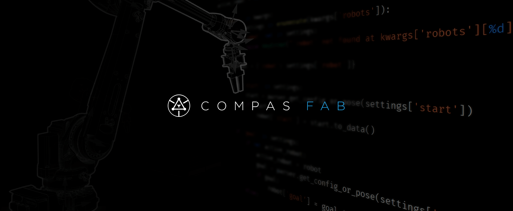

*******************************************************************************
Robotic Fabrication for COMPAS
*******************************************************************************

**Robotic fabrication package for the COMPAS Framework** facilitating the
planning and execution of robotic fabrication processes. It provides interfaces
to existing software libraries and tools available in the field of robotics
(e.g. OMPL, ROS) and makes them accessible from within the parametric design
environment. The package builds upon `COMPAS <https://compas.dev/>`_,
an open-source Python-based framework for collaboration and research in
architecture, engineering and digital fabrication.

Contents
========

.. toctree::
   :maxdepth: 3
   :titlesonly:

   overview
   getting_started
   backends
   examples
   reference
   contributing
   authors
   changelog
   license
