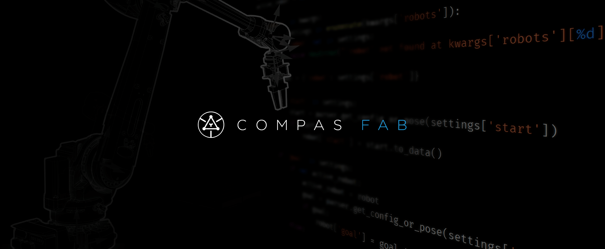

*******************************************************************************
Robotic Fabrication for COMPAS
*******************************************************************************

.. rst-class:: lead

**Robotic fabrication package for the COMPAS Framework** facilitating the
planning and execution of robotic fabrication processes. It provides interfaces
to existing software libraries and tools available in the field of robotics
(e.g. OMPL, ROS) and makes them accessible from within the parametric design
environment. The package builds upon `COMPAS <https://compas.dev/>`_,
an open-source Python-based framework for collaboration and research in
architecture, engineering and digital fabrication.

Main features
=============

* Built on top of standard model description formats
* Motion planning tools
* Execution tools
* CAD-independent
* Robotic fabrication process modeling
* Multiple robotic backends (e.g. `ROS: Robot Operating System <https://www.ros.org>`_)

**COMPAS FAB** runs on Python 3.x.

Learn to use COMPAS FAB
=======================

The :ref:`getting_started` section details how to install and set up 
the framework, depending on the front-end (CAD Environment) and back-end
(motion planner) you want to use.
The :ref:`concepts` section provides an overview of the main concepts
used in the framework.
The :ref:`frontends` section contains examples of how to use interact
with the framework from different front-ends, such as Rhino, Grasshopper,
and COMPAS Viewer.
The :ref:`backends` section describes the different back-ends available
for motion planning and execution, such as ROS and PyBullet.

The :ref:`analysis` section provides advanced functions for analyzing a
robot's workspace, reachability, and kinematics. 
The :ref:`api` section contains all the functions and classes
available in the framework, including their documentation and usage examples.

.. toctree::
   :maxdepth: 1
   :titlesonly:

   Introduction <self>
   getting_started
   concepts
   frontends
   backends
   analysis
   api
   contributing
   authors
   changelog
   license

Indices and tables
==================

* :ref:`genindex`
* :ref:`modindex`
